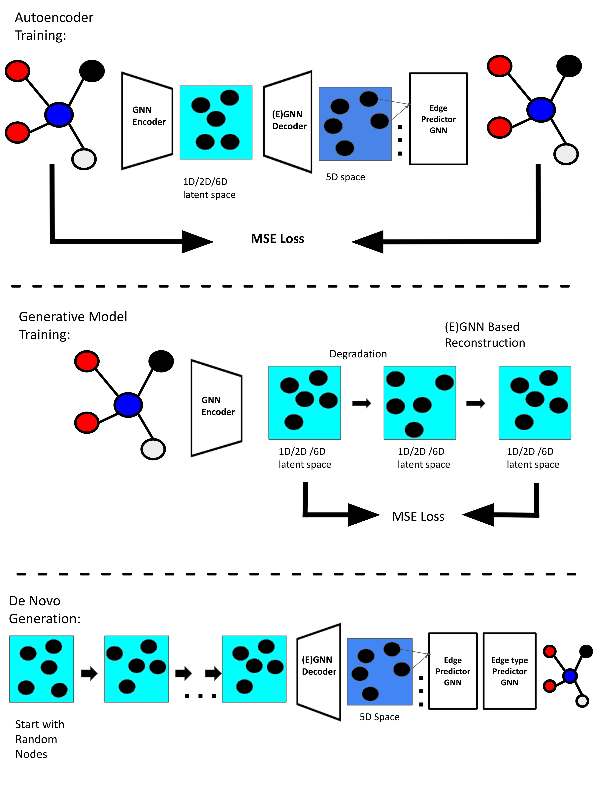

# Molecule-Generation-using-Latent-Space-Graph-Diffusion

Traditional methods for drug discovery are time-consuming processes that require meticulous planning and substantial financial investments. This process has limited the discovery and development of novel drugs. The recent growth in computational models and machine learning has enabled scientists to leverage deep learning to generate new molecules and aid in the drug discovery process. While there are several approaches to generating molecules, graph-based methods hold significant promise due to their ability to leverage the structural properties of molecules. Generating molecular graphs is a challenging task due to their discrete nature and competing objectives. The rapid growth in diffusion models and other generative AI techniques has significantly transformed the landscape of generative AI, particularly in fields that require generating novel data from complex distributions. Diffusion models have emerged as state-of-the-art approaches in data generation across various modalities. The complexity of using diffusion models for molecular generation is influenced by multiple parameters, making it challenging to identify optimal configurations. This thesis explores the design of different methods for molecule generation using diffusion models. In this thesis, we systematically examine different approaches and hyperparameters, contrasting generative flow models (denoising diffusion, flow matching, heat dissipation) and architectures (GNNs and E(3)-equivariant GNNs). Our experiments reveal a high sensitivity to the choice of approach and design decisions. This can help researchers understand the impact of different parameters on the molecule generation process and select the optimal approach for their use case.

Procedure to train:
To train models from stratch,

1) Train the Edge type prediction notebook and save the edge type prediction model 
2) Proceed to train the specific model from their respective notebooks. The notebooks include code for training and saving the models, followed by generation. 
3) If you do not wish to train the models again, All the pre trained modes are available in the models folder and can be loaded in the respective notebooks.

